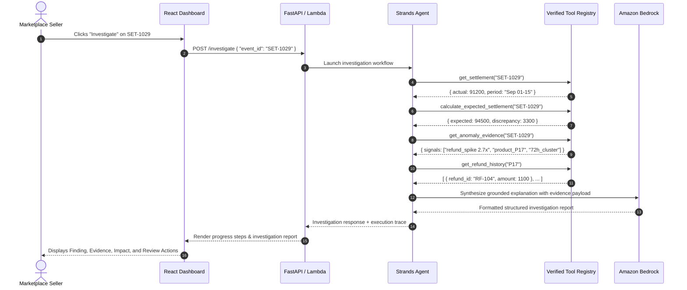

# FinGraph Sentinel — AI Agent & Tool Registry Specification

**Architecture Framework:** Strands Agents SDK  
**Foundation Model:** Amazon Bedrock (Claude 3.5 Sonnet / Amazon Nova)  
**Role:** Senior Financial Investigation Assistant (Decision-Support Only)

---

## 1. Agent Design Principles & Guardrails

FinGraph Sentinel deploys a **single controlled orchestrator agent** built with the Strands Agents SDK to investigate flagged anomalies.

### Critical Safety Guardrails
1. **Never Invent Numbers:** The model must never hallucinate financial values, balances, or discrepancy sums. All numbers cited in responses must originate directly from verified tool outputs.
2. **Deterministic Computation Separation:** The agent never calculates sums, taxes, or reconciliations internally; it delegates all arithmetic to deterministic Python tools (`calculate_expected_settlement`, `get_fee_summary`).
3. **Strict Decision-Support Framing:** The agent **never** declares "fraud", "theft", or "crime". It reports factual anomalies (e.g., *"Settlement is ₹3,300 below expected value due to a 2.7× refund spike on Product P17"*), highlights why the pattern is unusual, and recommends specific verification steps for the human seller.
4. **Read-Only Capability:** The agent has zero authorization or tooling to execute fund transfers, alter ledger balances, or modify seller records.

---

## 2. Tool Registry (The 11 Verified Tools)

| # | Tool Function | Input Parameters | Deterministic Output Description |
| :--- | :--- | :--- | :--- |
| 1 | `get_transaction` | `transaction_id: str` | Returns timestamp, amount, payment method, payer, payee, and order linkage. |
| 2 | `get_order_history` | `order_id: str` or `product_id: str` | Returns customer order records, item pricing, quantities, and dates. |
| 3 | `get_product_history` | `product_id: str` | Returns historical sales volume, return rate, average margin, and baseline refunds. |
| 4 | `get_supplier_history` | `supplier_id: str` | Returns supplier age, total historical payout sum, and average order frequency. |
| 5 | `get_refund_history` | `product_id: str` or `order_id: str` | Returns timestamped refund entries, refund reasons, and amounts. |
| 6 | `get_return_history` | `product_id: str` or `order_id: str` | Returns return authorization logs and physical return statuses. |
| 7 | `get_fee_summary` | `period: str` | Returns itemized breakdown of platform referral fees, FBA, and storage charges. |
| 8 | `get_settlement` | `settlement_id: str` | Returns the official marketplace payout record (gross, deductions, net paid). |
| 9 | `calculate_expected_settlement` | `settlement_id: str` | Recomputes: $\text{Gross Sales} - \text{Fees} - \text{Refunds} = \text{Expected}$. |
| 10 | `get_anomaly_evidence` | `event_id: str` | Fetches pre-computed anomaly metrics from `evidence_engine.py`. |
| 11 | `get_financial_summary` | `period: str` | Returns macro business metrics (GMV, net margin, total anomalies, settlement delta). |

---

## 3. Investigation Execution Flow



---

## 4. Standard Investigation Output Contract

Every investigation response must adhere to this contract:

```markdown
Finding:
<1-2 concise sentences summarizing the discrepancy or behavioral deviation>

Evidence:
• <Verified Tool Metric 1>
• <Verified Tool Metric 2>
• <Verified Tool Metric 3>

Financial Impact:
<Explicit ₹ amount impact on cash flow, margins, or disbursement>

Why It Matters:
<Underlying operational reason, e.g. return surge within 72h settlement cutoff>

Recommended Review:
1. <Actionable check step 1>
2. <Actionable check step 2>

Confidence & Limitations:
High confidence in verified ledger figures. Analysis is based on recorded marketplace events within cycle Sep 01-15.
```
