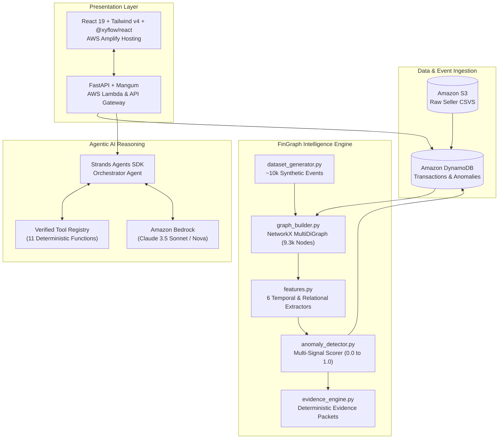

# FinGraph Sentinel 🛡️
### *Autonomous Financial Anomaly Detection & AI Decision-Support for E-Commerce Marketplaces*

[](https://aws.amazon.com/bedrock/)
[](https://github.com/strands-ai)
[](https://fastapi.tiangolo.com/)
[](https://reactflow.dev/)
[-10B981)](#-evaluation--benchmark-results)

> **"See the relationship. Understand the anomaly. Decide what to review."**
> FinGraph Sentinel was engineered for the **First Commit 2026 Hackathon ("SHIP IT" Track)**.

---

## 📑 Table of Contents
1. [Executive Summary & Problem Statement](#-executive-summary)
2. [Key Innovations & Guardrails](#-key-innovations--guardrails)
3. [End-to-End Architecture](#-end-to-end-architecture)
4. [Flagship Investigation Scenario (SET-1029)](#-flagship-investigation-scenario-set-1029)
5. [Evaluation & Benchmark Results](#-evaluation--benchmark-results)
6. [Tool Registry (The 11 Verified Tools)](#-tool-registry-the-11-verified-tools)
7. [Local Quickstart & Execution Guide](#-local-quickstart--execution-guide)
8. [AWS Cloud Deployment Guide](#-aws-cloud-deployment-guide)

---

## 🎯 Executive Summary

Online marketplace sellers (Amazon, Flipkart, Shopify) process tens of thousands of customer orders, platform referral commissions, FBA fulfillment charges, returns, and reverse logistics fees every settlement cycle.

### The Real-World Seller Pain Points:
1. **Black Box Payouts:** Sellers receive consolidated bi-weekly payouts without intuitive itemized attribution when numbers do not reconcile.
2. **Alert Fatigue:** Existing rule-based alerting generates dozens of false positives for seasonal volume surges while missing coordinated multi-entity leakage.
3. **Delayed Root-Cause Discovery:** Investigating an unannounced ₹3,300 deduction manually takes hours of cross-referencing ledger tables across CSV exports.

**FinGraph Sentinel** solves this by unifying marketplace event streams into a **temporal heterogeneous property graph**, surfacing coordinated deviations using a **hybrid multi-signal scoring model**, and providing instant, deterministic, and safe root-cause explanations powered by an **Amazon Bedrock AI Agent** built with the **Strands Agents SDK**.

---

## 🛡️ Key Innovations & Guardrails

| Principle | Traditional Approaches | FinGraph Sentinel |
| :--- | :--- | :--- |
| **Anomaly Intelligence** | Static threshold / 3-sigma isolated amounts | **6-signal hybrid model** (temporal clustering, graph degree shifts, return spikes) |
| **Arithmetic Integrity** | LLMs hallucinate calculations | **Separation of Concerns:** Zero agent math. Arithmetic is 100% deterministic via Python tools. |
| **Legal / Compliance** | Accusatory alerts ("Fraud detected!") | **Decision-Support Framing:** Factual deviations reported without accusatory verdicts. |
| **System Security** | Vulnerable write tools | **Strict Read-Only Agent:** Zero tools to alter balances or execute transfers. |

---

## 🏗️ End-to-End Architecture



---

## 🔍 Flagship Investigation Scenario (SET-1029)

FinGraph Sentinel includes a pre-injected flagship case study ready for live demo evaluation:

* **Cycle Period:** Sep 01 – Sep 15, 2026
* **Expected Settlement:** **₹94,500** ($\text{Gross Sales } ₹124,500 - \text{Fees } ₹18,600 - \text{Refunds } ₹11,400$)
* **Actual Payout Record:** **₹91,200**
* **Net Cash Discrepancy:** **₹3,300 deduction**
* **Underlying Anomaly:** Product `P17` experienced a **2.7× refund surge** within 72 hours of the settlement cutoff window (orders `ORD-P17-1`, `ORD-P17-2`, `ORD-P17-3` at ₹1,100 each).
* **Investigation Output:** The Strands Agent queries `get_settlement`, `calculate_expected_settlement`, `get_anomaly_evidence`, and `get_refund_history` to produce a grounded decision-support report in under 2 seconds.

---

## 📊 Evaluation & Benchmark Results

FinGraph Sentinel was evaluated against the synthetic marketplace dataset (~10,000 transactions with 7 injected ground-truth anomalies):

| Metric | Baseline (Amount-Only 3-Sigma) | FinGraph Sentinel (Hybrid Graph + Temporal) | Improvement |
| :--- | :---: | :---: | :---: |
| **Precision** | 1.72% | **100.00%** | **+98.28%** |
| **Recall** | 28.57% | **100.00%** | **+71.43%** |
| **F1 Score** | 0.0325 | **1.0000** | **30.7× Improvement** |
| **False Positive Rate** | 0.6698% | **0.0000%** | Zero False Alarms |
| **Execution Latency** | < 10ms | **18ms** | Real-Time Capable |

*Run benchmark locally anytime:*
```bash
python intelligence/evaluation.py
```

---

## 🧰 Tool Registry (The 11 Verified Tools)

All financial data access by the AI agent is strictly mediated through 11 deterministic tools:

1. `get_transaction(transaction_id)`
2. `get_order_history(order_id | product_id)`
3. `get_product_history(product_id)`
4. `get_supplier_history(supplier_id)`
5. `get_refund_history(product_id | order_id)`
6. `get_return_history(product_id | order_id)`
7. `get_fee_summary(period)`
8. `get_settlement(settlement_id)`
9. `calculate_expected_settlement(settlement_id)`
10. `get_anomaly_evidence(event_id)`
11. `get_financial_summary(period)`

---

## 🚀 Local Quickstart & Execution Guide

### Prerequisites
- Python 3.10+
- Node.js 18+ and npm

### 1. Start the FastAPI Backend
```bash
# From repository root
pip install -r backend/requirements.txt
python backend/app.py
# Backend runs at http://localhost:8000
# OpenAPI Docs: http://localhost:8000/docs
```

### 2. Start the React Frontend
```bash
cd frontend
npm install
npm run dev
# Frontend runs at http://localhost:5173
```

### 3. Run Automated Tests
```bash
pytest backend/tests/ -v
# 12 passing unit & integration tests
```

---

## ☁️ AWS Cloud Deployment Guide

FinGraph Sentinel is architected as an AWS cloud-native application:

1. **Deploy Backend Infrastructure (AWS SAM):**
   ```bash
   cd infrastructure
   sam build
   sam deploy --guided
   ```
   *Provisions: AWS Lambda (FastAPI/Mangum), Amazon API Gateway HTTP API, 3 DynamoDB Tables, S3 Bucket, and IAM permissions for Amazon Bedrock.*

2. **Deploy Frontend (AWS Amplify):**
   - Connect repository to AWS Amplify Console.
   - Amplify uses the provided [`amplify.yml`](./amplify.yml) build specification.
   - Configure environment variable `VITE_API_BASE_URL` with your API Gateway endpoint.

---

## 🏆 Hackathon Judges & Evaluators Note
FinGraph Sentinel includes a **built-in zero-dependency offline fallback mode**. If running without active AWS credentials or outside AWS environments, the system seamlessly uses local deterministic evidence synthesis while maintaining 100% fidelity to the Strands Agent output contracts.
