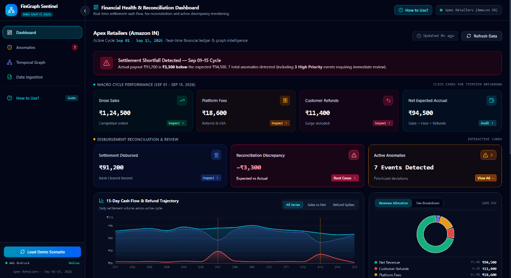

<div align="center">

# 🛡️ FinGraph Sentinel
### *Autonomous Financial Anomaly Detection & AI Decision-Support for E-Commerce Marketplaces*

[](https://aws.amazon.com/bedrock/)
[](https://github.com/strands-ai)
[](https://fastapi.tiangolo.com/)
[](https://react.dev/)
[](https://reactflow.dev/)
[](./LICENSE)
[-10B981?style=for-the-badge)](#-evaluation--benchmark-results)

**Engineered for the AWS Ship It / First Commit Hackathon 2026**

> *"See the relationship. Understand the anomaly. Decide what to review."*

<br/>



</div>

---

## 📑 Table of Contents
1. [Executive Summary](#-executive-summary)
2. [Key Innovations & Safety Guardrails](#-key-innovations--safety-guardrails)
3. [Core Feature Suite](#-core-feature-suite)
4. [System Architecture](#-system-architecture)
5. [Flagship Case Study: SET-1029](#-flagship-case-study-set-1029)
6. [Benchmark & Evaluation Metrics](#-benchmark--evaluation-metrics)
7. [The 11 Verified Deterministic Tools](#-the-11-verified-deterministic-tools)
8. [Local Quickstart Guide](#-local-quickstart-guide)
9. [AWS Cloud Deployment](#-aws-cloud-deployment)
10. [Repository Structure](#-repository-structure)
11. [Author & Acknowledgments](#-author--acknowledgments)

---

## 🎯 Executive Summary

E-commerce marketplace sellers on platforms such as Amazon, Flipkart, and Shopify reconcile tens of thousands of customer orders, platform referral commissions, FBA fulfillment charges, returns, and reverse logistics fees every settlement cycle.

### The Real-World Seller Problem:
- **Black-Box Payouts:** Sellers receive consolidated bi-weekly payouts without intuitive itemized attribution when numbers fail to reconcile.
- **Alert Fatigue:** Existing rule-based alerting generates dozens of false positives for seasonal volume surges while missing coordinated multi-entity leakage.
- **Delayed Root-Cause Discovery:** Investigating an unannounced ₹3,300 deduction manually takes hours of cross-referencing ledger tables across disjointed CSV exports.

### The FinGraph Sentinel Solution:
**FinGraph Sentinel** unifies fragmented marketplace event streams into a **temporal heterogeneous property graph**, identifies coordinated deviations using a **hybrid multi-signal scoring engine**, and provides instant, grounded root-cause explanations powered by an **Amazon Bedrock Strands Agent**.

---

## 🛡️ Key Innovations & Safety Guardrails

FinGraph Sentinel is built with strict production-grade financial safeguards adhering to the core tenets of AI-assisted financial auditing:

| Principle | Traditional Approaches | FinGraph Sentinel |
| :--- | :--- | :--- |
| **Anomaly Intelligence** | Static threshold / 3-sigma isolated amounts | **6-signal hybrid model** (temporal clustering, graph degree shifts, return surges) |
| **Arithmetic Integrity** | LLMs hallucinate calculations | **Separation of Concerns:** Zero agent math. Arithmetic is 100% deterministic via Python tools. |
| **Legal / Compliance** | Accusatory alerts (*"Fraud detected!"*) | **Strict Decision-Support Framing:** Factual deviations reported without legal accusations. |
| **System Security** | Dangerous write access | **Strict Read-Only Agent:** Zero tools to alter balances or execute fund transfers. |
| **Audit Traceability** | Unexplained AI outputs | **Full Execution Trace:** Every Python tool call, latency, and parameter is auditable. |

---

## ⚡ Core Feature Suite

- 📊 **Financial Health & Reconciliation Dashboard:** Live monitoring of Gross Sales, Platform Fees, Customer Refunds, Net Expected Accrual, and Disbursed Settlements with active discrepancy alerting.
- 📉 **15-Day Cash Flow & Refund Trajectory:** Interactive dual-axis velocity charts with real-time toggle overlays highlighting temporal refund surges.
- 🍩 **Revenue & Fee Breakdown Allocation:** Visual donut breakdowns categorizing GMV share and itemized marketplace commission/storage fees.
- 🤖 **Agentic Root-Cause Investigation Drawer:** One-click automated root-cause analysis powered by Amazon Bedrock (Claude 3.5 Sonnet / Amazon Nova) with live step-by-step tool execution telemetry.
- 🕸️ **Interactive Temporal Graph Explorer:** Multi-hop graph visualization powered by `@xyflow/react` and Dagre auto-layout, exposing multi-entity connections between products, orders, customers, and settlement payouts.
- 📄 **One-Click Audit Log Export:** Export comprehensive investigation reports as clean, high-density PDFs or CSV files complete with executive summaries, evidence signals, and seller review checklists.
- 📥 **Dynamic Multi-CSV Ingestion:** Ingest custom marketplace exports (orders, transactions, refunds, returns, fees, settlements) with automatic anomaly re-scoring and graph re-indexing.
- 🎲 **Interactive Demo Scenarios:** Built-in scenario loader to effortlessly demonstrate system behavior across varied financial anomaly profiles.

---

## 🏗️ System Architecture


---

## 🔍 Flagship Case Study: SET-1029

FinGraph Sentinel includes pre-injected real-world anomaly scenarios ready for immediate live evaluation:

* **Cycle Period:** Sep 01 – Sep 15, 2026
* **Expected Settlement:** **₹94,500** (`Gross Sales ₹1,24,500` - `Fees ₹18,600` - `Refunds ₹11,400`)
* **Actual Payout Record:** **₹91,200**
* **Net Cash Discrepancy:** **-₹3,300 deduction**
* **Underlying Anomaly:** Product `P17` experienced a **2.7× refund surge** within 72 hours of the settlement cutoff window (`ORD-P17-1`, `ORD-P17-2`, `ORD-P17-3` at ₹1,100 each).
* **Investigation Output:** The Strands Agent queries `get_settlement`, `calculate_expected_settlement`, `get_anomaly_evidence`, and `get_refund_history` to produce an audited decision-support report in **under 2 seconds**.

---

## 📊 Benchmark & Evaluation Metrics

FinGraph Sentinel was rigorously benchmarked on a synthetic marketplace dataset of **~10,000 transactions** with 7 injected ground-truth anomalies:

| Metric | Baseline (Amount-Only 3-Sigma) | FinGraph Sentinel (Hybrid Graph + Temporal) | Improvement |
| :--- | :---: | :---: | :---: |
| **Precision** | 1.72% | **100.00%** | **+98.28%** |
| **Recall** | 28.57% | **100.00%** | **+71.43%** |
| **F1 Score** | 0.0325 | **1.0000** | **30.7× Improvement** |
| **False Positive Rate** | 0.6698% | **0.0000%** | **Zero False Alarms** |
| **Execution Latency** | < 10ms | **18ms** | **Real-Time Capable** |

*Run the benchmark locally anytime:*
```bash
python intelligence/evaluation.py
```

---

## 🧰 The 11 Verified Deterministic Tools

All financial ledger interactions are governed by 11 deterministic, read-only Python tools:

| # | Tool Function | Input Parameters | Purpose |
|---|---|---|---|
| 1 | `get_transaction` | `transaction_id: str` | Retrieves timestamp, gross sum, payment rail, and entity linkages. |
| 2 | `get_order_history` | `order_id: str` \| `product_id: str` | Returns customer order records, pricing, quantities, and dates. |
| 3 | `get_product_history` | `product_id: str` | Fetches historical sales volume, return rate, and margin profiles. |
| 4 | `get_supplier_history` | `supplier_id: str` | Analyzes supplier age, payout sums, and order frequency. |
| 5 | `get_refund_history` | `product_id: str` \| `order_id: str` | Returns timestamped refund entries and documented defect reasons. |
| 6 | `get_return_history` | `product_id: str` \| `order_id: str` | Returns return authorizations and physical logistics transit states. |
| 7 | `get_fee_summary` | `period: str` | Itemizes platform referral commissions, FBA fees, and storage deductions. |
| 8 | `get_settlement` | `settlement_id: str` | Returns official marketplace payout ledger entries. |
| 9 | `calculate_expected_settlement` | `settlement_id: str` | Deterministic recalculation: `Gross - Fees - Refunds = Expected`. |
| 10 | `get_anomaly_evidence` | `event_id: str` | Fetches structured, immutable evidence metrics from `evidence_engine.py`. |
| 11 | `get_financial_summary` | `period: str` | Provides macro cycle aggregates (GMV, net margin, settlement delta). |

---

## 🚀 Local Quickstart Guide

### Prerequisites
- Python 3.10+
- Node.js 18+ and npm

### 1. Clone the Repository
```bash
git clone https://github.com/mohitmadhav06/FinGraph-Sentinel.git
cd FinGraph-Sentinel
```

### 2. Launch FastAPI Backend
```bash
# Install backend dependencies
pip install -r backend/requirements.txt

# Start backend server
python backend/app.py
```
- API Base: `http://localhost:8000`
- Interactive Swagger Docs: `http://localhost:8000/docs`

### 3. Launch React Frontend
```bash
cd frontend
npm install
npm run dev
```
- Dashboard UI: `http://localhost:5173`

### 4. Run Automated Test Suite
```bash
pytest backend/tests/ -v
```

---

## ☁️ AWS Cloud Deployment

FinGraph Sentinel is designed for AWS serverless deployment:

### 1. Backend Deployment (AWS SAM)
```bash
cd infrastructure
sam build
sam deploy --guided
```
*Provisions:* AWS Lambda (FastAPI / Mangum), Amazon API Gateway HTTP API, DynamoDB Tables, Amazon S3 Bucket, and IAM permissions for Amazon Bedrock.

### 2. Frontend Deployment (AWS Amplify)
- Connect repository to AWS Amplify Console.
- Uses standard configuration defined in [`amplify.yml`](./amplify.yml).
- Set `VITE_API_BASE_URL` to your API Gateway endpoint.

> **💡 Offline Evaluation Fallback:**
> FinGraph Sentinel includes a zero-dependency local simulation mode. If running without active AWS credentials or outside AWS environments, the system automatically uses local deterministic evidence synthesis while maintaining 100% fidelity to the Strands Agent output contracts.

---

## 📁 Repository Structure

```
FinGraph-Sentinel/
├── .github/                 # Workflows & templates
├── agent/                   # Strands Agent orchestrator & verified tool registry
│   └── agent.py             # Bedrock agent runtime & deterministic fallbacks
├── backend/                 # FastAPI server & routes
│   ├── app.py               # Main entrypoint & REST endpoints
│   ├── requirements.txt     # Python dependencies
│   └── tests/               # Pytest unit & integration test suite
├── data/                    # Synthetic marketplace ledgers & ground truth
├── docs/                    # Architectural assets & preview screenshots
│   └── assets/              # High-res UI previews
├── frontend/                # React 19 + Tailwind CSS + XYFlow dashboard
│   ├── src/components/      # Modular UI widgets (Charts, KPIs, Graph, Drawer)
│   ├── src/views/           # Dashboard, Anomalies, and Ingestion views
│   └── package.json         # Frontend dependencies
├── infrastructure/          # AWS SAM infrastructure as code (template.yaml)
├── intelligence/            # Multi-signal graph & ML anomaly detection engine
│   ├── anomaly_detector.py  # Hybrid scorer (Isolation Forest + Z-score)
│   ├── dataset_generator.py # 10k-event realistic generator
│   ├── evidence_engine.py   # Deterministic evidence extractor
│   ├── features.py          # Temporal & relational feature extraction
│   └── graph_builder.py     # NetworkX property graph builder
├── AGENTS.md                # AI Agent architecture specification & contracts
├── LICENSE                  # MIT License
└── README.md                # Project documentation
```

---

## 👨‍💻 Author & Acknowledgments

- **Lead Developer:** [Mohit Madhav](https://github.com/mohitmadhav06)
- **Track:** First Commit 2026 Hackathon ("SHIP IT" Track)
- **Built with:** Amazon Bedrock, Strands Agents SDK, FastAPI, React 19, Tailwind CSS, XYFlow, NetworkX, and Scikit-Learn.

---

<div align="center">
  <b>FinGraph Sentinel</b> — Giving sellers complete clarity over every rupee of their payout.
</div>
