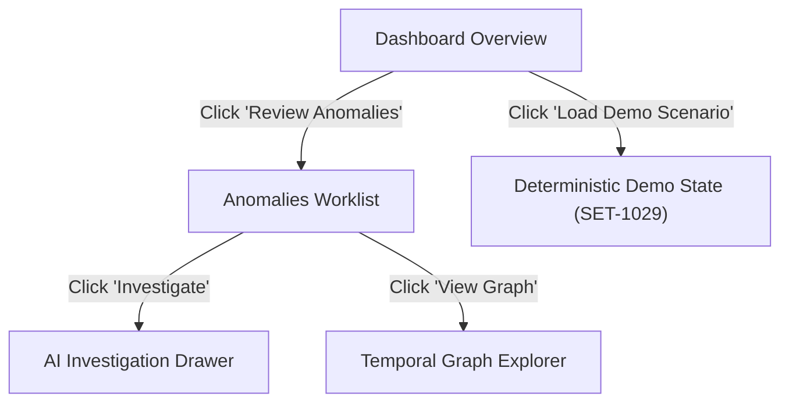

# FinGraph Sentinel — UI/UX Specification

**Design Philosophy:** Modern, trustworthy, high-density fintech investigation workspace.  
FinGraph Sentinel avoids generic bootstrap/admin template aesthetics, adopting an institutional-grade dark/slate palette with crisp data visualizations and clear visual hierarchy.

---

## 1. Design System & Theme Tokens

### Color Palette (Tailwind CSS)
- **Backgrounds:**
  - App Background: `#0B0F19` (Slate 950 / Deep Obsidian)
  - Card & Container Surface: `#111827` (Slate 900)
  - Surface Border / Separator: `#1F2937` (Slate 800)
  - Hover & Interactive Surface: `#1E293B` (Slate 800/700)
- **Primary & Accents:**
  - Brand Primary (Cyan/Blue): `#06B6D4` (Cyan 500) / `#3B82F6` (Blue 500)
  - Accent / Focus: `#6366F1` (Indigo 500)
- **Anomaly Severity Badges:**
  - High Priority: Background `#451A1A`, Border `#DC2626`, Text `#FCA5A5`
  - Medium Priority: Background `#422006`, Border `#D97706`, Text `#FCD34D`
  - Low / Info: Background `#172554`, Border `#2563EB`, Text `#93C5FD`
  - Reconciled / Healthy: Background `#052E16`, Border `#16A34A`, Text `#86EFAC`
- **Typography:**
  - Font Family: `Inter`, system-ui, sans-serif
  - Monospace (IDs, currency, numbers): `JetBrains Mono`, `Fira Code`, monospace

---

## 2. Core Screens & User Flow

---

## 3. Screen Specifications

### 1. Financial Dashboard
- **Header Bar:**
  - Product Logo + Brand: `FinGraph Sentinel`
  - Active Seller Entity: `Apex Retailers (Amazon IN)`
  - Current Settlement Cycle Selector (e.g., `Sep 01 - Sep 15, 2026`)
  - Status Indicators: AWS Cloud Status (`Connected`), Bedrock Agent (`Online`), NetworkX Graph (`Active`)
  - **Action Button:** `Load Demo Scenario` (Instant prefill)
- **Top Financial KPI Cards:**
  1. *Gross Sales* (₹12,45,000)
  2. *Platform Fees* (₹1,86,750 — 15.0%)
  3. *Refunds* (₹48,200 — 3.8%)
  4. *Returns* (₹18,500 — 1.5%)
  5. *Net Revenue* (₹9,91,550)
  6. *Settlement Amount* (₹9,88,250 with discrepancy tag)
  7. *Active Anomalies* (7 flagged events)
- **Attention Banner:**
  - Prominent alert: `⚠️ 7 financial events require review in the current period`
- **Quick Action Spotlight Card:**
  - Highlighted card for `Settlement SET-1029` (Discrepancy: ₹3,300) with direct `[View Graph]` and `[Investigate]` buttons.
- **Trend Charts:**
  - 14-day Gross Sales vs. Refund rate area chart (Recharts).
  - Fee distribution donut chart.

### 2. Anomalies Worklist
- **Filtering & Search:**
  - Search by Entity / Event ID (`SET-1029`, `TX-8291`, `SUP-04`)
  - Filter by Category: *Settlement Mismatch*, *Refund Spike*, *New Supplier*, *Amount Deviation*, *Transaction Burst*
  - Filter by Priority: *High*, *Medium*, *Low*
- **Table Columns:**
  - Anomaly ID & Category
  - Associated Entity (Product, Supplier, Order, Settlement)
  - Priority Score & Badge (`0.82 High`)
  - Financial Impact (e.g., `-₹3,300`)
  - Detected Signals (badges: `Refund 2.7x`, `Novel Edge`, `72h Cluster`)
  - Actions: `[View Graph]` (opens subgraph), `[Investigate]` (triggers Strands agent)

### 3. AI Investigation Drawer / Modal
- **Trigger:** User clicks `[Investigate]` on any anomaly row or spotlight card.
- **Top Header:** Anomaly Summary (`Settlement SET-1029`, Expected ₹94,500 vs. Actual ₹91,200, Gap ₹3,300).
- **Live Tool Progress Stepper:**
  - Interactive status list showing verified tool calls in real time:
    - `✓ Settlement SET-1029 retrieved from ledger`
    - `✓ Historical settlement baseline compared (Mean: ₹96,200)`
    - `✓ Refund transaction logs analyzed (3 refunds detected)`
    - `✓ Product relationships evaluated (Product P17 identified as primary driver)`
    - `✓ Discrepancy reconciled: ₹3,300 unexplained variance explained by P17 refunds`
- **AI Investigation Report (Standard Grounded Format):**
  - **Finding:** Concise factual summary of what occurred.
  - **Evidence:** Bulleted list of deterministic metrics returned by tools.
  - **Financial Impact:** Net financial consequence on payout / cash flow.
  - **Why It Matters:** Root cause context (e.g., return velocity vs fee timing).
  - **Recommended Review:** Concrete human-actionable checklist.
  - **Confidence & Limitations:** Explicit statement of model constraints.
- **Actions:** `[Export PDF / Audit Log]`, `[Mark as Reviewed]`, `[Dismiss]`.

### 4. Temporal Graph Explorer (React Flow)
- **Interactive Canvas:**
  - Built with `React Flow` with dark theme styling.
  - Custom React Flow Nodes:
    - `SellerNode` (Central hub)
    - `ProductNode` (Catalog SKU)
    - `OrderNode` (Customer purchases)
    - `RefundNode` (Red highlight for anomalous refund nodes)
    - `SupplierNode` (Yellow highlight for novel relationships)
    - `SettlementNode` (Disbursement hub)
    - `BankNode` (Disbursement destination)
  - Directed Animated Edges:
    - Edge labels displaying amount (₹), transaction count, and timestamp.
    - Pulsing animated stroke for edges contributing to the selected anomaly.
- **Subgraph Focus Control:**
  - Automatically centers on the ego-network (1-to-2 hops) of the investigated entity to prevent visual clutter.
  - Interactive click on any node or edge brings up an **Entity Detail Inspector** slideover.

### 5. Data Upload & Demo Management
- Drag-and-drop CSV upload for:
  - `orders.csv`, `transactions.csv`, `refunds.csv`, `returns.csv`, `fees.csv`, `settlements.csv`
- File validation check with schema verification badge.
- One-click **"Load Official Demo Dataset"** button for instant evaluator review.
